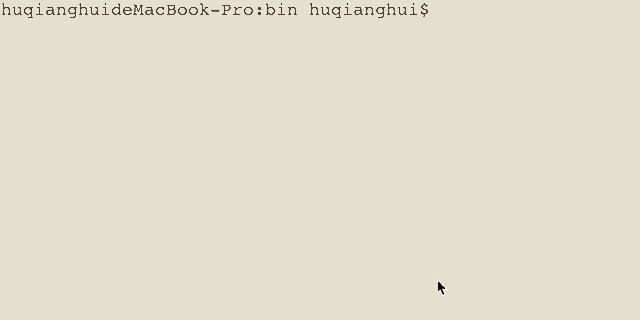

<!-- @import "[TOC]" {cmd="toc" depthFrom=2 depthTo=3 orderedList=false} -->

# apache-flink本地使用手册

## zookeeper

### 查看zookeeper 信息

#### 本地mac通过brew 安装的brew info zookeeper 查看zookeeper的一些目录和运行信息

    1. 可以通过zkServer status 查看运行信息
    2. ps -ef |grep java 查看zookeeper是否启动
    3. jps -l 查看org.apache.zookeeper.server.quorum.QuorumPeerMain

### zookeeper配置信息

    通过status显示的信息，可以得到zookeeper当前配置文件目录/usr/local/etc/zookeeper/zoo.cfg得到client 连接zkServer端口为2181

## kafka

### kafka的依赖zookeeper

  kafka是以来zookeeper的，所以再使用kafka之前要使zookeeper先起来。如果没有的化， 根据brew info kafka 的命令提示：
  zookeeper-server-start /usr/local/etc/kafka/zookeeper.properties & kafka-server-start /usr/local/etc/kafka/server.properties
  
### 查看kafka状态

    1. 通zookeeper一样通过java进程信息
            ps -ef |grep java
            jps -l
    2. 在kafka的bin目录/usr/local/Cellar/kafka/2.3.0/bin里面有很多命令，可以通过命令查看
        a) 查看所有的topic: ./kafka-topics --zookeeper localhost:2181  --list
           里面有生成者，消费者，可以用来消息的生成和消费
        b) 通过console 往topic中发送消息
            命令如下：./kafka-console-producer --broker-list localhost:9092 --topic persona

    3. kafka的配置
        如1）中显示/usr/local/etc/kafka/server.properties里面，
        #把listeners行的注释去掉，这个表示kafka消息队列的监听端口，用于生产者监听使用
        #把listeners修改为如下：
            listeners=PLAINTEXT://你的ip地址:9092      

## 启动kafDrop(kafka的UI)

    1. githhub上有源码，本地已经下载下来了。路径：/Users/huqianghui/Downloads/Kafdrop-master
    2. 通过kafDrop，关键是可以看到每个topic的offset和每条消息内容
    3. 命令行：java -jar /Users/huqianghui/Downloads/Kafdrop-master/target/kafdrop-2.0.6.jar --zookeeper.connect=localhost:2181
       通过http://localhost:9000/ 可以访问

## apache-flink安装与运行

brew install apache-flink就可以使用

然后就可以通过UI查看
